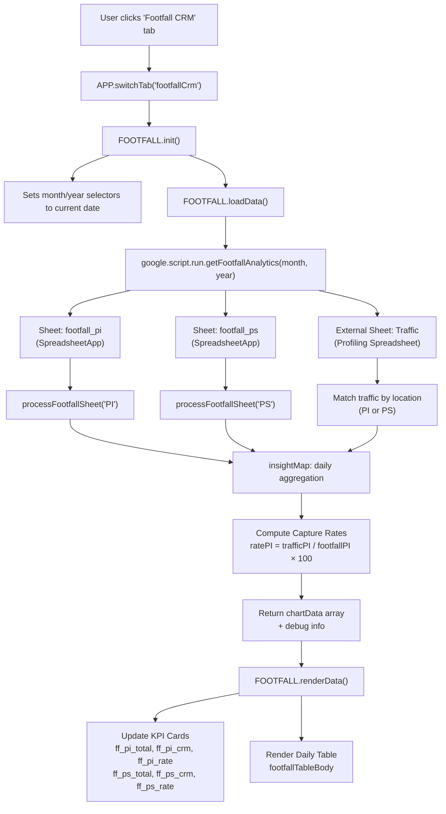

# Footfall (CRM) — Full Module Analysis

## 🗂 File Map

| Layer | File | Location | Purpose |
|-------|------|----------|---------|
| **Config** | [1-Config.gs](file:///d:/Bvlgari%20Dashboard/1-Config.gs#L20-L21) | Outer Dashboard | Sheet names `footfall_pi`, `footfall_ps` + column mapping |
| **Backend API** | [12-API_Footfall.gs](file:///d:/Bvlgari%20Dashboard/12-API_Footfall.gs) | Outer Dashboard | 2 functions: `getFootfallAnalytics()` + `getFootfallData()` |
| **Frontend View** | [ViewFootfall.html](file:///d:/Bvlgari%20Dashboard/ViewFootfall.html) | Outer Dashboard | HTML layout: KPI cards + data table |
| **Frontend JS** | [JsFootfall.html](file:///d:/Bvlgari%20Dashboard/JsFootfall.html) | Outer Dashboard | FOOTFALL object: init, loadData, renderData, exportCSV |
| **Chart Renderer** | [JavaScript_Charts.html](file:///d:/Bvlgari%20Dashboard/JavaScript_Charts.html#L98-L208) | Outer Dashboard | `renderCustomerFootfall()` — used by **Footfall (Store)** view, NOT this CRM view |
| **Navigation** | [Index.html](file:///d:/Bvlgari%20Dashboard/Index.html#L220-L229) | Outer Dashboard | Sidebar button `tabFootfallCrm` |
| **Router** | [JavaScript.html](file:///d:/Bvlgari%20Dashboard/JavaScript.html#L236) | Outer Dashboard | Tab switch calls `FOOTFALL.init()` |

---

## 📊 Data Flow Architecture



---

## 🔍 Data Sources (3 Sheets)

### 1. `footfall_pi` (Local Sheet)
- **Source:** Google Sheets (`getSpreadsheet()`)
- **Columns:** `Col A` = Date, `Col C` = Masuk (In count)
- **Purpose:** Physical door counter data for Plaza Indonesia

### 2. `footfall_ps` (Local Sheet)
- **Source:** Google Sheets (`getSpreadsheet()`)
- **Columns:** Same structure as PI
- **Purpose:** Physical door counter data for Plaza Senayan

### 3. `Traffic` (External Sheet)
- **Source:** `SpreadsheetApp.openById(PROFILING_SHEET_ID)`
- **Sheet Name:** `Traffic` (from `CONFIG.EXTERNAL.TRAFFIC_SHEET_NAME`)
- **Key Columns:**
  - `Col L (idx 11)` = Date
  - `Col G (idx 6)` = Location (matched to "PLAZA INDONESIA" or "PLAZA SENAYAN")
  - `Col AM (idx 38)` = Group size (visitor count captured by CRM advisor)
- **Purpose:** CRM-captured traffic (visitors who were profiled by advisors)

---

## 📐 Core Logic: Capture Rate Formula

```
Capture Rate = (CRM Captured Visitors / Total Door Footfall) × 100%
```

> **Example:** If the door counter records 500 people entering PI today, and advisors profiled 150 of them in the Traffic sheet → Capture Rate = 30%

The threshold for color coding is **30%**:
- `< 30%` → 🔴 Red (poor capture)
- `≥ 30%` → 🟢 Green (PI) / 🟠 Amber (PS) (acceptable)

---

## 🖥 UI Structure

### KPI Cards (2 store cards, side by side)
| Plaza Indonesia | Plaza Senayan |
|:---:|:---:|
| Total Footfall (`ff_pi_total`) | Total Footfall (`ff_ps_total`) |
| Captured CRM (`ff_pi_crm`) | Captured CRM (`ff_ps_crm`) |
| Capture Rate (`ff_pi_rate`) | Capture Rate (`ff_ps_rate`) |

### Daily Table (7 columns)
| Date | PI Footfall | PI Captured | PI Rate% | PS Footfall | PS Captured | PS Rate% |

### Export Button
- CSV download with BOM (`\uFEFF`) for Excel compatibility

---

## ⚠️ Issues & Observations

### 1. **Duplicate Backend Function**
[12-API_Footfall.gs](file:///d:/Bvlgari%20Dashboard/12-API_Footfall.gs) contains **two** functions:
- `getFootfallAnalytics()` (Lines 7-153) — Used by **this** Footfall CRM view
- `getFootfallData()` (Lines 154-294) — Used by **Footfall (Store)** view via `CHARTS.renderCustomerFootfall()`

These are completely separate logic paths with different return shapes.

### 2. **No Charts/Graphs**
The Footfall CRM view is **table-only** — no line charts, no trend visualizations. There is significant opportunity to add:
- Daily capture rate trend line chart
- PI vs PS comparison bar chart
- Weekly aggregation heatmap

### 3. **Filter is Self-Contained**
Unlike other views which use the global `monthSelect`/`yearSelect` filters in the top bar, this module has its own inline selectors (`footfallMonthSelect`, `footfallYearSelect`) in **Indonesian** (Januari, Februari...) vs English (January, February) for the outer dashboard. The main filter is hidden when this tab is active (line 296-297 in JavaScript.html).

### 4. **No Caching**
Every filter change triggers a fresh `getDataRange().getValues()` across 3 sheets (2 local + 1 external). This is slow for large datasets.

### 5. **CSV Export Bug**
The CSV export uses double-escaped BOM `\\uFEFF` and newlines `\\n` (lines 140-142 in JsFootfall.html). These should be single-escaped: `\uFEFF` and `\n`.

### 6. **No "ALL" Year Support**
The month selector has "ALL" option, but the year selector does not, creating an inconsistency.

### 7. **Bali Store Missing**
The system only tracks PI and PS. If there's a Bali store with footfall data, it's not captured here.

---

## 🔗 Relationship to Other Footfall Views

| View | Tab Name | API Function | Renderer |
|------|----------|-------------|----------|
| **Footfall (Store)** | `tabFootfall` | `getFootfallData()` | `CHARTS.renderCustomerFootfall()` |
| **Footfall (CRM)** | `tabFootfallCrm` | `getFootfallAnalytics()` | `FOOTFALL.renderData()` |

- **Footfall (Store)** is a sub-view of the "Crossing Sales" view, focuses on daily in/out traffic with demographics (men/women %)
- **Footfall (CRM)** is an independent view focused on **Capture Rate** (how many visitors get profiled)
